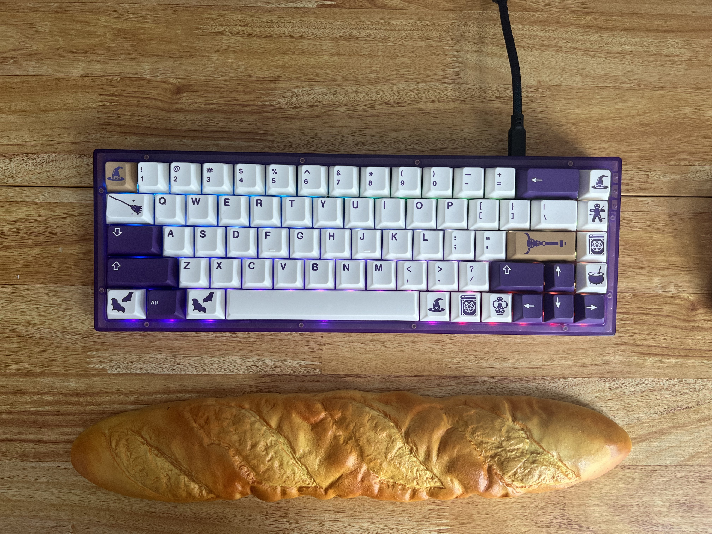
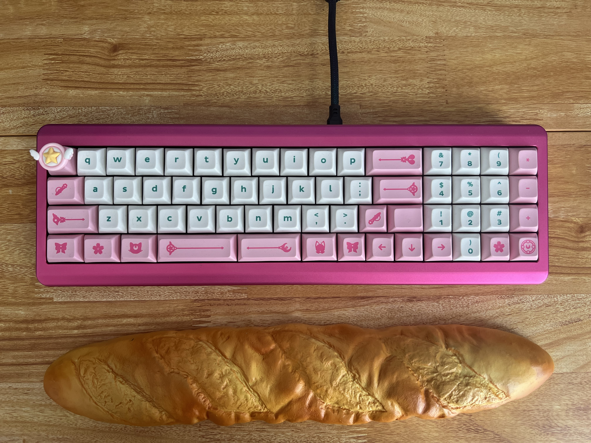

# My Keyboard Collection

My collection is ever-evolving, as I'm constantly changing configurations and switching things up. Here are some of my favorite configurations.

## Keychron Q1

My Filipino culture keyboard that is more of an art piece than a daily driver. KAT Katha keycaps, KTT HaluHalo switches (hand lubed and filmed), FR4 plate, KFC artisan keycap (the closest I could get to a Jollibee Chickenjoy), and a bowl of rice artisan keycap.

## Qwertykeys QK100

My Halloween slasher build. KDS Splatter keycaps, Cherry MX Black Clear-top switches (Nixies, hand lubed), DSS Hail Satan novelties, and a Ghostface gif. 

## Qwertykeys QK75

Osume Little Ghost keycaps, NK Silk Milshake switches (factory lubed).

## Zoom75

Milk Tea Essential Edition. Osume Dalgona keycaps, Prevail Epsilon switches (factory lubed), and a cute kitty gif.

## Melody 96 Wood

SA Espresso keycaps, Gateron Cap Golden Brown switches.

## Cyberboard Le Smoking

The most frivolous purchase of my life, but also the sexiest. Very Cool Very Ghoul keycaps, HKP Lucky Cat artisan, and Drop Holy Panda X switches.

## GMMK Pro

Green top frame, ePBT Soju keycaps, and Zaku II switches.

## GMMK Pro

Blue top frame, ePBT Ramenstop keycaps, Wuque Studio Morandi switches (factory lubed), HKP Lucky Cat artisan, and Sailor Moon artisan.

## Zoom65

Astrolokeys keycaps, Alpaca switches (hand lubed).

## Kit Adam

Magic Girl Millenium keycaps, Gateron Azure Dragon switches, custom blue and yellow LEGO plates.

## RK100

Lofree Touch Graffiti keycaps, Glorious Lynx switches (factory lubed).

## NK65

ePBT Witch keycaps, Akko Jelly Black switches (hand lubed).

## Candybar

Mintlodica Magic Girl keycaps, C3Equalz Banana Split switches (hand lubed). This build  has serious case ping, but that was significantly improved with a silicone pour. Tbh, I'm not big on the layout, but it's pretty and weird and I can't seem to let it go.

## Akko Alice Pro

Nature Witch keycaps, Akko Crystal switches (factory lubed). Another layout that's not really my bag, but I do love the way this board sounds. 